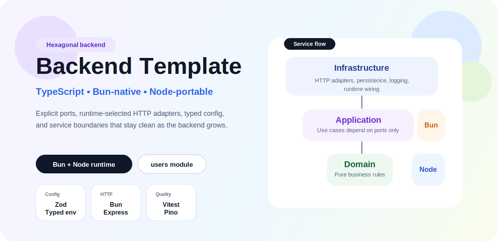
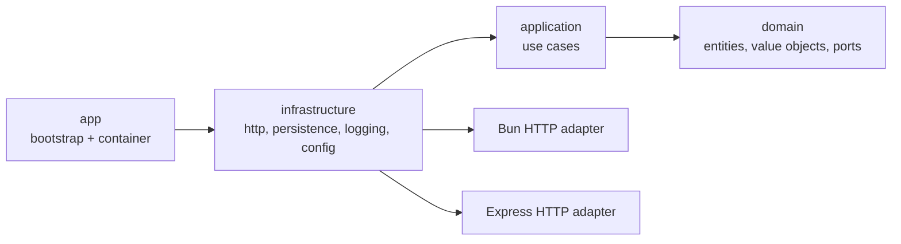
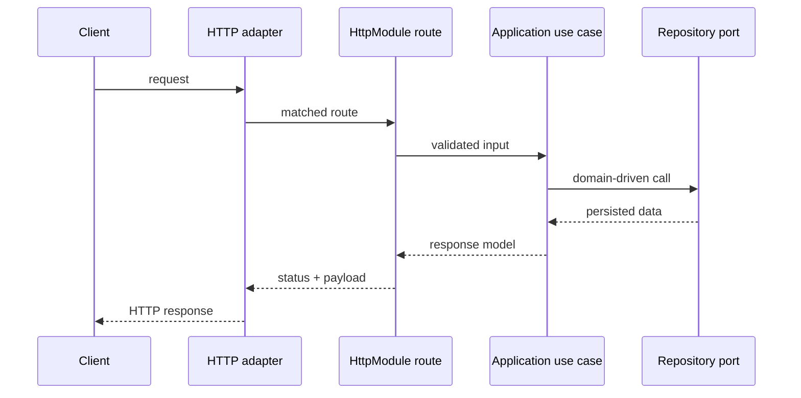

<p align="center">
  
</p>

<h1 align="center">Hexagonal Backend Template in TypeScript</h1>

<p align="center">
  Pure backend foundation with explicit ports, runtime-selected HTTP adapters, typed environment configuration, and a clean service boundary designed to stay portable across Bun and Node.js.
</p>

<p align="center">
  
  
  
  
  
</p>

<p align="center">
  
  
  
</p>

<p align="center">
  <a href="#architecture-at-a-glance">Architecture</a> •
  <a href="#request-flow">Request Flow</a> •
  <a href="#english">English</a> •
  <a href="#espanol">Español</a>
</p>

| Focus | Runtime model | Example module | Quality gates |
| --- | --- | --- | --- |
| Portable backend service foundation | Bun-native HTTP when running on Bun, Express fallback on Node.js | `users` plus operational `health` endpoint | ESLint, Vitest, Supertest, dprint |

## Architecture At A Glance



## Request Flow



<a id="english"></a>
<details open>
<summary><strong>English</strong></summary>

> [!NOTE]
> Node compatibility is intentionally preserved so the template stays broadly reusable, but unless there is a concrete restriction, `bun` is the recommended runtime for both ergonomics and overall runtime performance.

Pure backend template with hexagonal architecture in TypeScript, designed to stay portable on Node.js while preferring Bun for local development and day-to-day execution.

Node compatibility is intentionally preserved so the template stays broadly reusable, but unless there is a concrete restriction, `bun` is the recommended runtime for both ergonomics and overall runtime performance. When the process runs on Bun, the template uses a Bun-native HTTP adapter. When it runs on Node.js, it falls back to Express.

### Quick Facts

| Area | Details |
| --- | --- |
| Repository goal | Provide a backend baseline with clear boundaries and no framework leakage into the domain |
| Architectural boundary | `domain` <- `application` <- `infrastructure` with bootstrap in `app` |
| Runtime split | Bun-native HTTP adapter on Bun, Express adapter on Node.js |
| Example surface | `users` module plus operational `health` endpoint |

### What Is Included

- `layer-first` structure: `domain`, `application`, and `infrastructure` at the top of the tree
- Runtime-selected HTTP bootstrap: Bun-native on Bun, Express on Node
- Typed environment configuration with `zod`
- Logging with `pino`
- Centralized error handling
- Manual dependency wiring, without a magic container
- Complete working `users` example
- Operational `health` endpoint, separated from business modules
- Unit and integration tests with `vitest` and `supertest`
- GitHub Actions CI validating both Node.js and Bun
- `Dockerfile`, GitHub Actions CI, ESLint, and dprint

### Stack

| Runtime | HTTP | Validation and logging | Quality |
| --- | --- | --- | --- |
| `Bun`, `Node.js 20+`, `TypeScript` | `Bun HTTP`, `Express` | `Zod`, `Pino` | `Vitest`, `Supertest`, `ESLint`, `dprint` |

### Structure

```text
src/
  app/
    createApp.ts
    createBunServer.ts
    createContainer.ts
    startHttpServer.ts
  domain/
    shared/
    system/
    users/
  application/
    shared/
    system/
    users/
  infrastructure/
    config/
    http/
      HttpModule.ts
      modules/
      routes/
    logging/
    persistence/
    system/
tests/
  unit/
  integration/
```

### Layers

#### Domain

This is where the pure business rules live. It does not know about Express, databases, environment variables, or technical infrastructure details. In the example:

- `User` is the aggregate root
- `UserId`, `UserName`, and `UserEmail` are value objects
- `UserCreatedEvent` shows how to model domain events
- `UserRepository` defines the port later implemented by infrastructure
- `HealthStatus` lives in `domain/system` because it represents an operational concern, not a business module

#### Application

This layer coordinates use cases and depends only on ports. In the example:

- `CreateUserUseCase`
- `GetUserByIdUseCase`
- `ListUsersUseCase`
- `GetHealthStatusUseCase`

This layer orchestrates business validations, transactions, domain event publication, and logging through interfaces.

#### Infrastructure

This layer implements concrete adapters. In the template:

- Bun-native HTTP adapter for Bun and Express adapter for Node, both backed by shared `HttpModule` definitions
- `InMemoryUserRepository` as a persistence example
- `PinoLogger`, `NodeClock`, `NodeIdGenerator`
- HTTP error and not-found middlewares
- HTTP routes grouped under `src/infrastructure/http/routes`

### How To Run It

With Bun:

```bash
cp .env.example .env
bun install
bun run dev
```

`bun run dev` and `bun run start` use the Bun-native HTTP adapter because the process runs on Bun.

With Node/npm:

```bash
cp .env.example .env
npm install
npm run dev:node
```

`npm run dev:node` and `npm run start:node` run on Node.js and therefore use the Express adapter.

Available scripts:

| Purpose | Bun / Node command |
| --- | --- |
| Bun dev | `bun run dev` |
| Node dev | `bun run dev:node` or `npm run dev:node` |
| Build | `bun run build` or `npm run build` |
| Bun start | `bun run start` |
| Node start | `bun run start:node` or `npm run start:node` |
| Tests | `bun run test` or `npm run test` |
| Coverage | `bun run test:coverage` or `npm run test:coverage` |
| Lint | `bun run lint` or `npm run lint` |
| Format check | `bun run format` or `npm run format` |
| Format write | `bun run format:write` or `npm run format:write` |

### Docker

The repository includes a Bun-based multi-stage `Dockerfile`.

| Stage | Runtime |
| --- | --- |
| Build | `Bun` |
| Runtime | `Bun` |
| Default container behavior | Bun-native HTTP adapter |

Build example:

```bash
docker build -t hexagonal-backend-template-ts .
```

Run example:

```bash
docker run --rm -p 3000:3000 --env-file .env hexagonal-backend-template-ts
```

The container exposes the backend on port `3000`.
Node portability remains available in the repository, but the default image is Bun-first.

### Example Endpoints

```http
GET    /health
GET    /api/v1/users
GET    /api/v1/users/:id
POST   /api/v1/users
```

Creation example:

```bash
curl --request POST \
  --url http://localhost:3000/api/v1/users \
  --header 'content-type: application/json' \
  --data '{
    "name": "Jane Doe",
    "email": "jane.doe@example.com"
  }'
```

### How To Extend The Template

1. Create the domain model in `src/domain/<feature>`.
2. Implement use cases in `src/application/<feature>`.
3. Connect adapters in `src/infrastructure`.
4. Register dependencies in `src/app/createContainer.ts`.
5. Add or update an `HttpModule` under `src/infrastructure/http` and let both runtime adapters consume it.

### What To Replace In A Real Project

- `InMemoryUserRepository` with a real adapter for Postgres, MySQL, MongoDB, Redis, or the storage you use
- `NoopTransactionManager` with a real implementation if your persistence supports transactions
- the `users` folder with your real bounded contexts
- the HTTP endpoints with REST, gRPC, jobs, queues, or the input adapter you actually need

### Design Decisions

- wiring is manual on purpose: it reduces magic and keeps dependencies obvious
- the example uses an in-memory repository so the template can run without external infrastructure
- the domain does not depend on frameworks
- the structure is intentionally layer-oriented to prioritize architectural readability in small and medium projects
- `health` does not hang from business modules: it is treated as an operational system concern
- HTTP adapters are runtime-specific, but the route definitions are shared so Bun and Express expose the same behavior
- the structure is intentionally backend-only and optimized for clear service boundaries
- test-only resets, fixtures, mocks, and similar helpers stay in `tests/**` or test setup, not in `src/**`, unless they are real runtime dependency boundaries
- runtime code should clean up listeners, timers, intervals, streams, sockets, and similar resources, and should avoid unbounded process-global caches or stores unless that boundary is intentional

</details>

<a id="espanol"></a>
<details>
<summary><strong>Español</strong></summary>

> [!NOTE]
> La compatibilidad con Node se mantiene para que el template sea más universal, pero si no hay una restricción concreta, la opción recomendada es usar `bun` por ergonomía y performance general del runtime.

Template de backend puro con arquitectura hexagonal en TypeScript, pensado para correr de forma portable sobre Node.js pero con preferencia práctica por Bun en desarrollo local y ejecución diaria.

La compatibilidad con Node se mantiene para que el template sea más universal, pero si no hay una restricción concreta, la opción recomendada es usar `bun`, tanto por ergonomía como por performance general del runtime. Cuando el proceso corre sobre Bun, el template usa un adapter HTTP nativo de Bun. Cuando corre sobre Node.js, hace fallback a Express.

### Resumen Rápido

| Área | Detalle |
| --- | --- |
| Objetivo del repositorio | Dar una base de backend con límites claros y sin filtración de frameworks hacia el dominio |
| Límite arquitectónico | `domain` <- `application` <- `infrastructure` con bootstrap en `app` |
| Split de runtime | Adapter HTTP nativo en Bun y adapter Express en Node.js |
| Superficie de ejemplo | módulo `users` más endpoint operativo `health` |

### Qué Incluye

- Estructura `layer-first`: `domain`, `application` e `infrastructure` al tope del árbol
- Bootstrap HTTP seleccionado por runtime: nativo de Bun en Bun y Express en Node
- Configuración tipada por entorno con `zod`
- Logging con `pino`
- Manejo centralizado de errores
- Wiring manual de dependencias, sin contenedor mágico
- Ejemplo funcional completo con `users`
- Endpoint operativo `health`, separado del área de negocio
- Tests unitarios e integración con `vitest` y `supertest`
- GitHub Actions CI validando tanto Node.js como Bun
- `Dockerfile`, CI de GitHub Actions, ESLint y dprint

### Stack

| Runtime | HTTP | Validación y logging | Calidad |
| --- | --- | --- | --- |
| `Bun`, `Node.js 20+`, `TypeScript` | `Bun HTTP`, `Express` | `Zod`, `Pino` | `Vitest`, `Supertest`, `ESLint`, `dprint` |

### Estructura

```text
src/
  app/
    createApp.ts
    createBunServer.ts
    createContainer.ts
    startHttpServer.ts
  domain/
    shared/
    system/
    users/
  application/
    shared/
    system/
    users/
  infrastructure/
    config/
    http/
      HttpModule.ts
      modules/
      routes/
    logging/
    persistence/
    system/
tests/
  unit/
  integration/
```

### Capas

#### Domain

Acá viven las reglas del negocio puras. No conoce Express, base de datos, variables de entorno ni detalles técnicos. En el ejemplo:

- `User` es el aggregate root
- `UserId`, `UserName` y `UserEmail` son value objects
- `UserCreatedEvent` muestra cómo modelar eventos de dominio
- `UserRepository` define el puerto que luego implementa infraestructura
- `HealthStatus` vive en `domain/system` porque representa un concern operativo, no un módulo de negocio

#### Application

Coordina casos de uso y depende solo de puertos. En el ejemplo:

- `CreateUserUseCase`
- `GetUserByIdUseCase`
- `ListUsersUseCase`
- `GetHealthStatusUseCase`

Esta capa orquesta validaciones de negocio, transacciones, publicación de eventos y logging a través de interfaces.

#### Infrastructure

Implementa adapters concretos. En el template:

- Adapter HTTP nativo de Bun para Bun y adapter de Express para Node, ambos apoyados sobre definiciones compartidas de `HttpModule`
- `InMemoryUserRepository` como ejemplo de persistencia
- `PinoLogger`, `NodeClock`, `NodeIdGenerator`
- middlewares HTTP de errores y not-found
- rutas HTTP agrupadas en `src/infrastructure/http/routes`

### Cómo Correrlo

Con Bun:

```bash
cp .env.example .env
bun install
bun run dev
```

`bun run dev` y `bun run start` usan el adapter HTTP nativo de Bun porque el proceso corre sobre Bun.

Con Node/npm:

```bash
cp .env.example .env
npm install
npm run dev:node
```

`npm run dev:node` y `npm run start:node` corren sobre Node.js y por eso usan el adapter de Express.

Scripts disponibles:

| Propósito | Comando Bun / Node |
| --- | --- |
| Dev con Bun | `bun run dev` |
| Dev con Node | `bun run dev:node` o `npm run dev:node` |
| Build | `bun run build` o `npm run build` |
| Start con Bun | `bun run start` |
| Start con Node | `bun run start:node` o `npm run start:node` |
| Tests | `bun run test` o `npm run test` |
| Cobertura | `bun run test:coverage` o `npm run test:coverage` |
| Lint | `bun run lint` o `npm run lint` |
| Check de formato | `bun run format` o `npm run format` |
| Escritura de formato | `bun run format:write` o `npm run format:write` |

### Docker

El repositorio incluye un `Dockerfile` multi-stage basado en Bun.

| Stage | Runtime |
| --- | --- |
| Build | `Bun` |
| Runtime | `Bun` |
| Comportamiento por defecto del contenedor | adapter HTTP nativo de Bun |

Ejemplo de build:

```bash
docker build -t hexagonal-backend-template-ts .
```

Ejemplo de ejecución:

```bash
docker run --rm -p 3000:3000 --env-file .env hexagonal-backend-template-ts
```

El contenedor expone el backend en el puerto `3000`.
La portabilidad con Node sigue disponible en el repositorio, pero la imagen por defecto pasa a ser Bun-first.

### Endpoints De Ejemplo

```http
GET    /health
GET    /api/v1/users
GET    /api/v1/users/:id
POST   /api/v1/users
```

Ejemplo de creación:

```bash
curl --request POST \
  --url http://localhost:3000/api/v1/users \
  --header 'content-type: application/json' \
  --data '{
    "name": "Jane Doe",
    "email": "jane.doe@example.com"
  }'
```

### Cómo Extender El Template

1. Crear el modelo de dominio en `src/domain/<feature>`.
2. Implementar casos de uso en `src/application/<feature>`.
3. Conectar adapters en `src/infrastructure`.
4. Registrar dependencias en `src/app/createContainer.ts`.
5. Agregar o actualizar un `HttpModule` en `src/infrastructure/http` y dejar que ambos adapters de runtime lo consuman.

### Qué Reemplazar En Un Proyecto Real

- `InMemoryUserRepository` por un adapter real de Postgres, MySQL, MongoDB, Redis o el storage que uses
- `NoopTransactionManager` por una implementación real si tu persistencia soporta transacciones
- la carpeta `users` por tus bounded contexts reales
- los endpoints HTTP por REST, gRPC, jobs, colas o el adapter de entrada que necesites

### Decisiones De Diseño

- el wiring es manual a propósito: reduce magia y hace obvias las dependencias
- el ejemplo usa un repositorio en memoria para que el template arranque sin infraestructura externa
- el dominio no depende de frameworks
- la estructura está deliberadamente orientada a capas para priorizar lectura arquitectónica en proyectos chicos y medianos
- `health` no cuelga de negocio: está tratado como concern operativo del sistema
- los adapters HTTP dependen del runtime, pero las definiciones de rutas son compartidas para que Bun y Express expongan el mismo comportamiento
- la estructura está deliberadamente enfocada en backend y en límites de servicio claros
- los resets, fixtures, mocks y helpers equivalentes exclusivos de testing van en `tests/**` o en el setup de pruebas, no en `src/**`, salvo que sean límites reales de dependencias de runtime
- el código de runtime debe limpiar listeners, timers, intervalos, streams, sockets y recursos similares, y debe evitar caches o stores globales sin cota salvo que ese límite sea intencional

</details>
